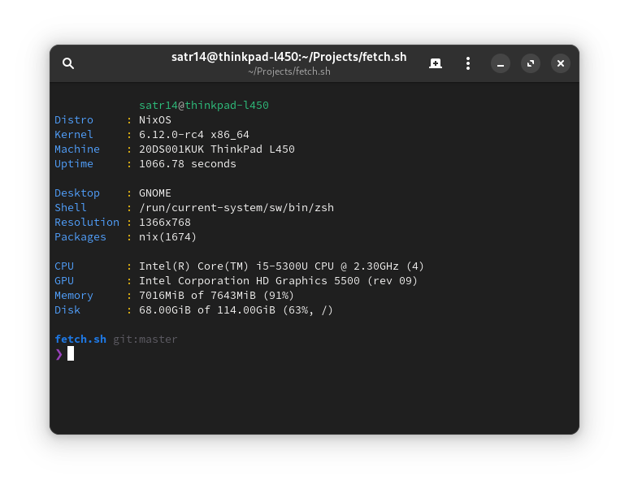

# fetch.sh
a simple fetch utility
writen in `/bin/sh` made to be as simple as possible



```sh
curl -fsSL fetch.satr14.my.id | sh -s -- color
```

## Usage
Just put the script somewhere in your `PATH` and run `fetch.sh`, to display with colors run `fetch.sh color`.
If you want to customize it, edit the environment variables and `printf` lines in `fetch.sh`'s `main` function.
